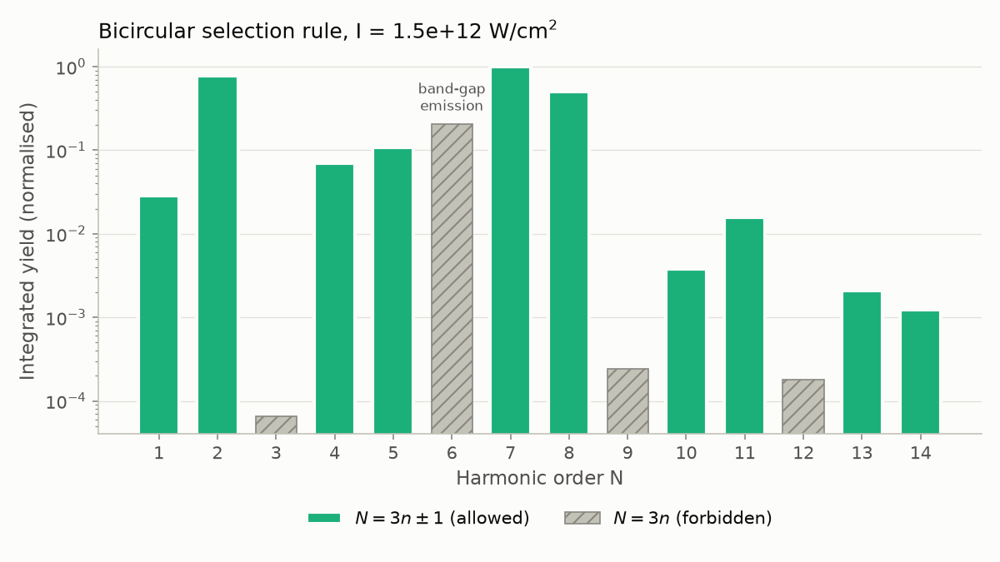
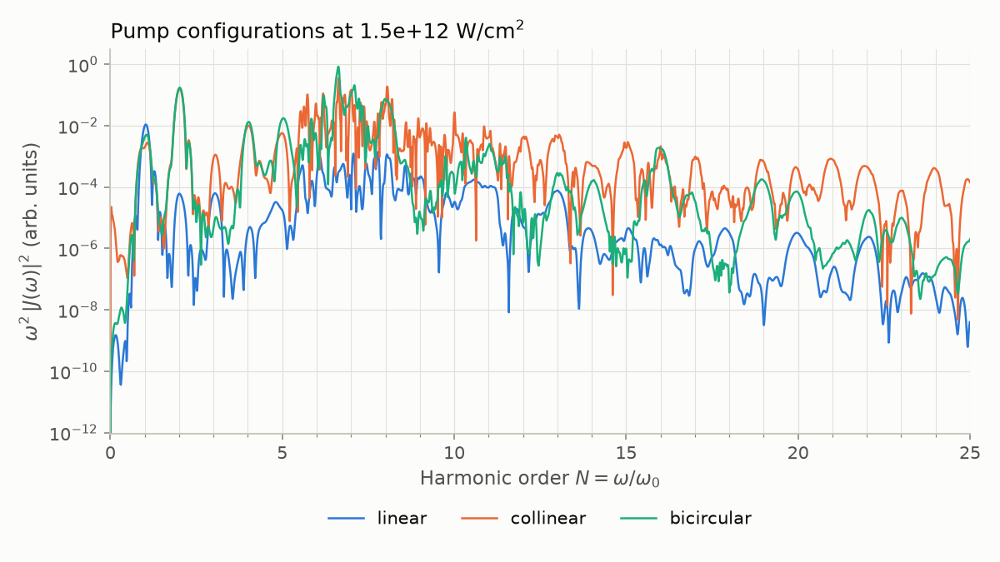
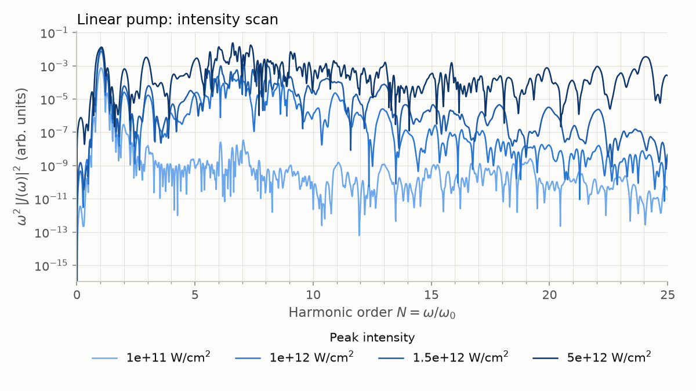
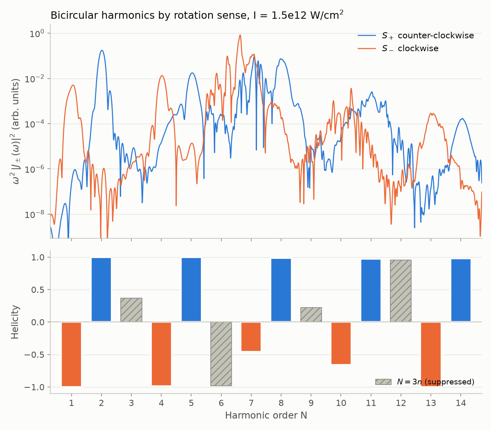

# High-Harmonic Generation from Time-Dependent Currents

[](https://github.com/lawanmuk/highharmonicgeneration/actions/workflows/ci.yml)
[](https://www.python.org/)
[](LICENSE)

High-harmonic generation (HHG) spectra of monolayer hexagonal boron nitride (hBN) driven by three pump configurations: **linear**, **collinear two-color** and **bicircular**. The time-dependent currents come from real-time TDDFT simulations; this repository holds those currents and the tested `hhg` Python package that turns them into harmonic spectra, harmonic yields and figures.

## Overview

- **`HHG_datasets/`**: total-current traces $\mathbf{J}(t)$ from real-time TDDFT, one file per run
- **`hhg`** (in `src/hhg/`): a Python package that reads the traces, computes windowed HHG spectra by FFT, integrates harmonic yields and regenerates every figure
- **`figures/`**: figures and a harmonic-yield table produced by `hhg-figures`
- **`legacy/`** and **`results/matlab/`**: the original processing scripts and their outputs, kept for reference

## Physics

The emitted intensity is proportional to the squared dipole acceleration, which for a current $\mathbf{J}(t)$ is

$$S(\omega) = \omega^2 \sum_{i=x,y,z} \left| \int J_i(t)\, w(t)\, e^{i\omega t}\, dt \right|^2 ,$$

with the smooth-step window $w(t) = 1 - 3x^2 + 2x^3$, $x = t/t_{\max}$, which goes from 1 to 0 with zero slope at both ends and suppresses truncation artefacts. Harmonic orders are $N = \omega/\omega_0$ with the pump photon energy $\hbar\omega_0 = 0.8266$ eV (wavelength 1.5 µm).

**Pump configurations**

| Configuration | Field | What it probes |
|---|---|---|
| Linear | single color $\omega_0$, linearly polarized | reference case |
| Collinear | $\omega_0$ and $2\omega_0$, polarized along the same axis | interference between the two colors |
| Bicircular | $\omega_0$ and $2\omega_0$, counter-rotating circular polarization | symmetry-controlled selection rules |

The bicircular field has three-fold rotational symmetry, which allows only harmonics $N = 3n \pm 1$ and suppresses $N = 3n$. The data show this clearly: harmonics 3, 9 and 12 are $10^3$ to $10^4$ times weaker than their neighbours. Harmonic 6 is not suppressed because $6\omega_0 \approx 5$ eV lies at the hBN band gap, where emission is not purely harmonic.







**Polarization of the harmonics**

Splitting the in-plane current into its two circular parts,

$$J_\pm(\omega) = \frac{J_x(\omega) \mp i J_y(\omega)}{\sqrt{2}}, \qquad S_\pm(\omega) = \omega^2 |J_\pm(\omega)|^2 ,$$

separates emission rotating counter-clockwise ($S_+$, from $x$ towards $y$) from emission rotating clockwise ($S_-$). Integrating each around a harmonic gives yields $Y_\pm$ and the helicity $h = (Y_+ - Y_-)/(Y_+ + Y_-)$: $+1$ or $-1$ for circular light, 0 for linear.

In the bicircular field each $3n+1$ harmonic takes the rotation of the $\omega_0$ pump and each $3n-1$ harmonic the rotation of the $2\omega_0$ pump, so neighbouring allowed harmonics rotate in opposite directions. The data follow this for every allowed order up to 14. Harmonics 1, 2, 4, 5, 8, 11, 13 and 14 are almost perfectly circular ($|h| > 0.95$); harmonics 7 and 10 have the right sign but are only partly circular ($h \approx -0.46$ and $-0.66$). For harmonic 7 this is probably because it overlaps the broad band-gap emission around orders 6 and 7. Linear and collinear runs give $h = 0$ for every harmonic, as they should. Per-harmonic values for every run are in `figures/harmonic_polarization.csv`.



## Installation

Requires Python 3.10 or newer.

```bash
git clone https://github.com/lawanmuk/highharmonicgeneration.git
cd highharmonicgeneration
pip install -e .
```

For development (tests and linting): `pip install -e ".[dev]"`

## Usage

Regenerate every figure and the yield and polarization tables (about 10 seconds):

```bash
hhg-figures --data HHG_datasets --out figures
```

From Python:

```python
import hhg

trace = hhg.load_current("HHG_datasets/bcp_I=1.5e12total_current.dat")
omega, spectrum = hhg.hhg_spectrum(trace)            # FFT, all current components
orders = omega / hhg.OMEGA_PUMP

yields = hhg.harmonic_yields(omega, spectrum, hhg.OMEGA_PUMP, range(1, 15))
contrast = hhg.selection_rule_contrast(
    hhg.harmonic_yields(omega, spectrum, hhg.OMEGA_PUMP, [1, 2, 4, 5, 7, 8]),
    hhg.harmonic_yields(omega, spectrum, hhg.OMEGA_PUMP, [3, 9, 12]),
)

pol = hhg.harmonic_polarization(trace, range(1, 15))
pol.helicity      # +1 counter-clockwise, -1 clockwise, 0 linear
pol.ellipticity   # signed minor/major axis ratio
```

## Data

Each file follows the `total_current` layout of real-time TDDFT codes such as Octopus: comment lines starting with `#`, then one row per time step with `Iter, t, I(1), I(2), I(3), ...` in atomic units. The time step is 0.08 a.u. in every run.

| File | Pump | Peak intensity (W/cm²) | Time steps | Duration (fs) |
|---|---|---|---|---|
| `lp_I=1e11total_current.dat` | linear | 1e11 | 51678 | 100.0 |
| `lp_I=1e12total_current.dat` | linear | 1e12 | 51678 | 100.0 |
| `lp_I=1.5e12total_current.dat` | linear | 1.5e12 | 51678 | 100.0 |
| `lp_I=5e12total_current.dat` | linear | 5e12 | 51678 | 100.0 |
| `cp_I=1.5e12total_current.dat` | collinear | 1.5e12 | 90751 | 175.6 |
| `cp_I=5e12total_current.dat` | collinear | 5e12 | 72363 | 140.0 |
| `bcp_I=1.5e12total_current.dat` | bicircular | 1.5e12 | 72363 | 140.0 |
| `bcp_I=1.5e12_run2total_current.dat` | bicircular, second run (see note) | 1.5e12 | 72363 | 140.0 |
| `bcp_pumpprobe_total_current.dat` | bicircular, pump-probe | – | 30766 | 59.5 |

**Note on `bcp_I=1.5e12_run2`.** This file was originally named `bcp_I=5e12`, but it is a second 1.5e12 W/cm² bicircular run. The data showed this before the label was confirmed: early in the pulse the current is linear in the field, so a 5e12 run must carry √(5/1.5) = 1.83 times the current of the 1.5e12 run. The linear and collinear pairs meet this to within 0.1 %, while this file gave 0.58, 1.55 and 1.45 over the first 20, 50 and 100 a.u. Its HHG spectrum matches the first 1.5e12 run to four significant digits, and the two traces are related by a rotation of about 120° and a time shift, a symmetry of the bicircular field, which suggests the two runs differ in field phase. The check is `hhg.early_response_ratio`; `tests/test_datasets.py` guards both the corrected label and the linear and collinear labels.

## Project structure

```
src/hhg/
    constants.py    unit conversions and the pump frequency
    io.py           reading current files, parsing run names
    spectrum.py     smooth-step window, direct and FFT transforms, HHG spectrum
    harmonics.py    harmonic yields and selection-rule contrast
    polarization.py circular components, helicity and ellipticity per harmonic
    diagnostics.py  intensity-label check from the early linear response
    figures.py      the hhg-figures command
tests/              pytest suite, including physics checks on the datasets
figures/            generated figures, harmonic_yields.csv and harmonic_polarization.csv
legacy/             original Python and MATLAB processing scripts
results/matlab/     spectra written by the MATLAB script
```

## Testing

```bash
pytest            # unit tests and dataset regression tests
ruff check .      # lint
ruff format .     # format
```

CI runs linting, the tests on Python 3.10 to 3.13, figure regeneration and a dependency audit on every push and pull request.

## Author

Mukhtar Lawan. The original processing scripts in `legacy/` were written in 2021; the `hhg` package is a rewrite with the corrections listed in [CHANGELOG.md](CHANGELOG.md).

## Contributing

See [CONTRIBUTING.md](CONTRIBUTING.md).

## License

MIT, see [LICENSE](LICENSE).
